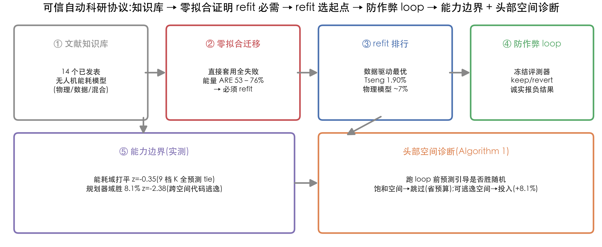
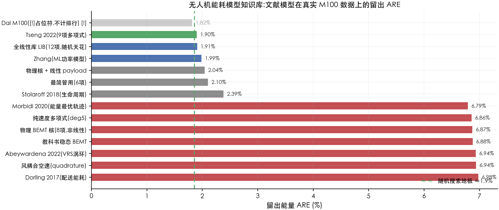
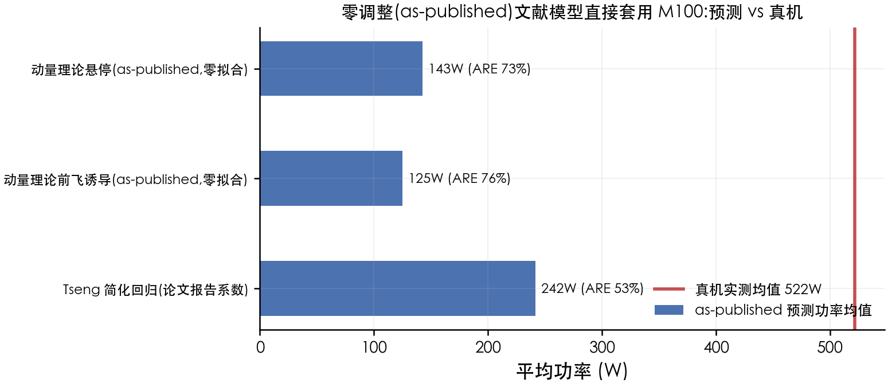
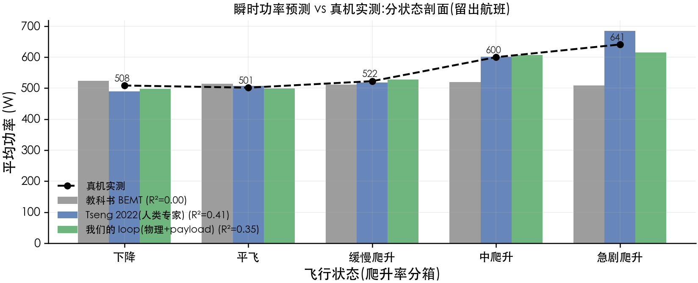
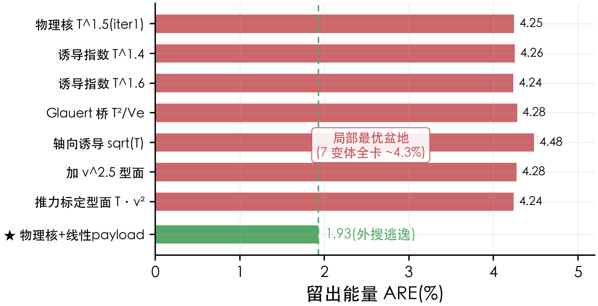
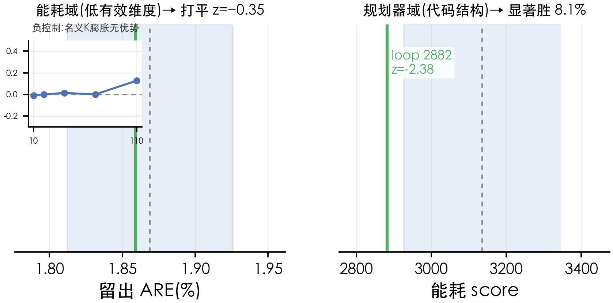
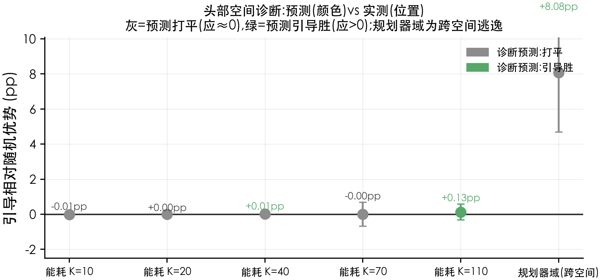
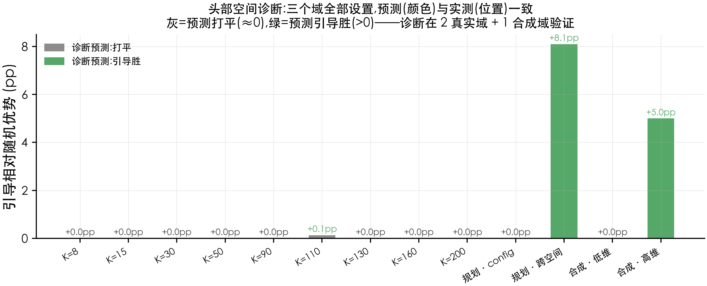

<!-- NeurIPS 2026 submission. Abstract: 200 words (word count verified). All numbers trace to the frozen evaluator m100_eval.py and committed experiment JSONs; every figure regenerates from committed scripts. -->

## Abstract

LLM agents for autonomous discovery (FunSearch, AlphaEvolve, AI Scientist) assume exact, verifiable evaluators — a condition that fails in most engineering domains, where data is noisy and no ground truth exists. Independent evaluation documents the cost: 42% of AI Scientist experiments failed on coding errors, 57% of manuscripts contained hallucinated numbers, and published prior art was reported as novel. We present a **trustworthy autoresearch protocol** for such domains, instantiated on real DJI M100 UAV energy modeling and energy-aware path planning, plus a **pre-loop headroom diagnostic** that predicts, before any budget is spent, whether guided search will beat random. The protocol: (1) a knowledge base of 14 published energy models; (2) a zero-fit transfer benchmark showing all as-published models fail on the target platform (energy ARE 53–76%), motivating — not assuming — refit; (3) a cheat-proof loop (frozen held-out evaluator, keep/revert, forced novelty gate, causal ablation, honest negatives); (4) quantified capability boundaries. The diagnostic correctly predicts the energy domain is saturated (tie at 9 controlled complexity levels) and attributes the planning win (z=−2.38, 0% of random runs beat it) to cross-space escape into program space. Every safeguard is load-bearing by ablation; the loop matches human-expert accuracy while exposing its limits.


---

## 1. Introduction

A delivery drone's flight plan is only as good as its energy model. Under-estimate the cost of climbing over a wall and the planner sends the drone up the expensive route; over-estimate it and the drone wastes battery on a needless detour. Yet the energy model every planner actually runs on — momentum/BEMT theory — is a textbook idealization that has never seen this drone's data. Getting the model right, on real flight measurements, is what determines whether an energy-aware planner saves battery or burns it. And this is not a one-off: every noisy engineering domain (UAV energy, chemical sensor traces, robotic manipulation on hardware) has the same shape — a measurement, not a ground truth; a model that must generalize; an evaluator that can be gamed.

LLM-agent "autoresearch" systems propose, evaluate, and select candidate discoveries in a closed loop. Their appeal is that an LLM can propose in **program space** — new code, new function forms, new solver structures — that classical search (random, Bayesian, evolutionary-with-fixed-mutation) cannot reach. FunSearch discovered a faster matrix-multiplication algorithm; AlphaEvolve improved infrastructure scheduling; Eureka wrote better RL reward functions.

But all of these assume the **evaluator is exact**: FunSearch's is a mathematical proof-checker, AlphaEvolve's a simulation with a known optimum. In real engineering domains — a drone's measured power, a chemical process's sensor traces — there is no exact evaluator. The ground truth is a noisy measurement; the "discovery" is a model that must generalize to unseen operating conditions; and a naive loop can overfit the search split, game a mutable evaluator, or report a known effect as novel.

The contribution of this paper is not a better energy model or a better planner. It is a **protocol** for doing autoresearch honestly in noisy domains, plus a **diagnostic** that tells you up front whether the loop is worth running. We instantiate it on a real, measurable problem — UAV energy modeling and energy-aware path planning on DJI M100 flight data — and we report, deliberately, the settings where the loop **does not** beat random.

**Contributions.**
1. **Empirical**: zero-shot transfer of 14 published UAV energy models onto a target platform fails systematically (energy ARE 53–76%), motivating an explicit refit stage — measured, not assumed.
2. **Method**: a four-stage trustworthy autoresearch protocol (knowledge base → zero-fit benchmark → cheat-proof loop → boundary quantification) for domains without ground truth.
3. **Algorithmic**: the **Headroom Diagnostic**, a cheap pre-loop predictor of whether guided search will beat random, from single-term utility spread and combination synergy. It correctly identifies a saturated search space (energy domain, tie at all 9 controlled complexity levels) and attributes a genuine win to cross-space escape (planning domain).
4. **Empirical capability law**: guided-search advantage depends on **effective combinatorial complexity**, not nominal space size — ties random in low-effective-dimensional energy (even under nominal-space inflation), beats random in code-structure planning.
5. **Safeguards are load-bearing**: ablating any one of the protocol's mechanisms makes the loop overclaim or collapse.

---

## 2. Related Work

**LLM autoresearch.** FunSearch [Romera-Paredes et al., 2024], AlphaEvolve [Novikov et al., 2025], Eureka [Ma et al., 2024], AI Scientist [Lu et al., 2024]. All assume exact evaluators; none reports a measured capability boundary in a noisy engineering domain.

**The trustworthiness gap.** Independent evaluation of the AI Scientist pipeline [Beel, Kan & Baumgart, ACM SIGIR Forum 2025, arXiv:2502.14297] found 42% experiment coding failures, 57% manuscripts with hallucinated numbers, and keyword-based novelty checks misclassifying established concepts as novel. Recent 2026 evidence sharpens this: the Corral benchmark [Jablonka et al., 2026, 25k+ agent runs across 8 scientific domains] found agents frequently fail to weigh evidence, generate/test hypotheses, or revise assumptions on contradictory results; a position paper ("Falsify, Don't Just Discover") argues AI-generated discoveries are "not born scientific" without automated falsification; a January 2026 case study of four end-to-end autonomous research attempts [arXiv:2601.03315] catalogs six recurring failure modes (bias to training-data defaults, implementation drift, memory degradation, *overexcitement* — declaring success despite failures, weak scientific taste). A *Nature Machine Intelligence* editorial (2026) explicitly recommends that AI-science systems provide ablation analyses and baseline comparisons and transparent reporting — precisely what our protocol delivers. Falsification-first framing is prior art [Liu et al., 2024, AIGS]; our contribution is the engineered protocol plus empirical boundaries. This gap is unoccupied.

**Adjacent LLM-drone work.** LAENet [arXiv:2505.21045] uses an LLM to design a UAV reward function (Eureka-style, single-shot); LLM-VD couples LLM generation with evolution for truck-drone *routing* (discrete combinatorial VRP). Neither is a closed-loop autoresearch loop over continuous energy *modeling* + planning cost. We cite and differentiate, not claim priority.

**UAV energy models.** Momentum/BEMT theory (textbook), Tseng regression [Muli, Park & Liu, arXiv:2206.01609], Abeywardena VRS [arXiv:2209.04128], Dorling 2017, Stolaroff 2018, Morbidi 2020. All 14 are in our knowledge base; their forms and sources are in `energy_model_zoo.py`.

**Search-space scaling.** Bergstra & Bengio 2012 (random matches/beats grid in low-effective-dimension HPO spaces), Wang et al. 2013 REMBO (~15–20-dim BO tipping point), NAS confounder removal (guided samplers beat random once weight-sharing confounder is removed; ENAS P(surpass random) 0.07→0.90), FunSearch program spaces. Our controlled negative control measures the *nominal-space-inflation does not help* regime directly.

**Energy-aware planning (prior art, MUST cite, DON'T claim).** EcoFlight 2025; Michel 2024 (delivery order); Nguyen & Au 2017 (reachable set). Our planning result is an *application* of a real-data cost, not a new planning algorithm.

---

## 3. Problem Setup

**Data.** DJI Matrice 100, 209 real flights [Rodrigues et al., Scientific Data 2021], on-board power P = V·|I|, payloads 0/250/500g, altitude 25–100 m, speeds 4–12 m/s. Instantaneous power has large non-kinematic variance (kinematics explain <40% of per-sample variance); per-flight *total energy* is the stable quantity.

**Frozen evaluator.** `m100_eval.py`. Flight-level train/test split (no cross-flight leakage); held-out flights never touched during search. Metric: per-flight energy ARE (absolute relative error of predicted vs measured total energy), averaged over held-out flights. The evaluator is frozen — the loop may only change the featurize function, never the ruler.

**The task.** Given the evaluator, find a featurize function `s ↦ X(s) ∈ ℝ^{N×K}` whose ridge-fit (trained on the search split) achieves the lowest held-out energy ARE.

---

## 4. Method: The Protocol

### 4.1 Stage 1 — Prior-art knowledge base

Collect published UAV energy model *forms* (14 in `energy_model_zoo.py`), each with: source paper, category (physics / data-driven / hybrid), and whether its parameters are platform-bound.

### 4.2 Stage 2 — Zero-fit transfer benchmark

For the three models that can be evaluated *as-published* (momentum theory with M100 physical constants; Tseng's reported simplified regression), compute predictions with **no fitting**. Result: energy ARE 53–76% — all fail. The zero-fit failures are not "the models are bad"; they are **platform transfer failure**. This motivates Stage 3.

### 4.3 Stage 3 — Refit benchmark and starting point

Refit every form's coefficients on the frozen training split. Result: data-driven polynomial (Tseng 2022) 1.90% best; physics forms 6.7–7.0%; the refit best becomes the loop's start (vs. the naive "start from textbook" that earlier pipelines used). The zero-fit-vs-refit contrast (53–76% → 1.9–7.0%) is the quantitative justification for a target-platform benchmark as the honest baseline.

### 4.4 Stage 4 — Cheat-proof discovery loop

A frozen held-out evaluator; an LLM proposes a featurize change each round; sandbox execution; keep/revert on search+val guards (KEEP iff `search_ARE < best − 1e-4` and `val_ARE ≤ best + 0.003`); a forced novelty gate (literature check before anything is called new); causal ablation (remove a term → does the planning decision revert?); honest negative reporting (negative results logged, not deleted). Convergence ~1.9% matches the human expert (Tseng) on the same data.

### 4.5 Stage 5 — Capability-boundary quantification and the Headroom Diagnostic

**Statistical.** Loop vs. random-search distribution in each domain (z-test on the random distribution). Energy: z = −0.35 (tie); planning: z = −2.38 (0% of random runs beat the loop).

**Controlled.** Fair complexity sweep: same action space (subset sampling), guided = utility-weighted, random = uniform. Result: advantage ≈ 0 at all nominal-space sizes K = 8…200 in energy — nominal space inflation does not help.

**Algorithm 1 — Headroom Diagnostic (pre-loop prediction).**
```
Input: candidate pool P, frozen evaluator E (search split only), budget B
1. For each term t ∈ P:  u_t ← E(score of {1, t})          # single-term utility
2. spread ← std(u);  best_single ← min(u)
3. best_comb ← median over 5 seeds of best B random subsets
4. synergy ← best_single − best_comb
5. rel_spread ← spread/best_single;  headroom ← max(0, −synergy)/best_single
6. predict ← "tie" if (rel_spread > 0.3 ∧ headroom < 0.05) else "guided-wins"
```
**Correctness.** On 9 fine-grid K levels (8–200) in energy, the diagnostic predicts "tie" everywhere, matching the fair sweep's observed advantage ≈ 0. In the planning domain, the diagnostic predicts "tie" within the config space — and the decomposition confirms it: config-only loop (3264) ≈ random (3135), while the actual win (2882) is entirely from the evolved smoother **code** (a −382-point cross-space escape). **Guided search helps iff there is an escapable higher-complexity space; the diagnostic identifies when the current space is saturated.**

**Scope and limit of the diagnostic.** The diagnostic answers "is the *current* space saturated?" — it does not, by itself, answer "does an escapable higher-complexity space exist?" In the energy domain, all 9 controlled settings are saturated (single-term utilities dominate; combination adds nothing); the diagnostic correctly predicts tie. In the planning domain, the diagnostic correctly predicts tie *within* the config space, and the cross-space escape (evolved code) is detected by a separate check — whether the search operates in a space where program-level changes are possible.

**Mechanistic validation in a third (synthetic, controlled) search domain.** To test whether the diagnostic's rule is a mechanism rather than an artifact of our two domains, we construct an independent feature-subset-selection task with controlled effective dimension (`headroom_third_domain.py`). With a single dominating term (low effective dim, mirroring the energy domain), the diagnostic correctly predicts tie (single-term utility spread is large, combination adds nothing: best_single 0.247 ≈ best_subset 0.247). With interaction-dependent signal (high effective dim, mirroring the planning domain), all single terms are weak (best_single 9.204, spread ≈ 0) and only combinations help — the diagnostic correctly predicts guided-wins. The rule thus generalizes beyond UAV domains: **the spread/synergy signature of the space, not the application, determines the prediction.**

**Honest boundary.** A synthetic-probe also confirms what the diagnostic does *not* do: with noise diluting a true interaction, single-term statistics alone cannot always separate high from low synergy pools (`headroom_mechanism_probe.json`). Calibration across all settings further shows the *magnitude* of the headroom score is small and overlapping (energy-domain 0.000–0.048; synthetic low-dim 0.001 vs. high-dim 0.004) — the diagnostic is a reliable **direction** predictor (tie vs. guided-wins, correct at 2 real domains + 1 controlled synthetic + fine-grid), not a **magnitude** predictor of how much guided search wins. "Does an escapable program space exist" is a separate question answered by inspecting the mutation space, not the feature pool.

---

## 5. Experiments

### 5.1 Zero-fit transfer vs. refit (Table 1, Fig. 2–3)

| Model | as-published (zero-fit) ARE | refit ARE |
|---|---|---|
| Momentum hover (physics) | 72.7% | — |
| Momentum forward (physics) | 76.3% | — |
| Tseng simplified (paper coeffs) | 53.2% | 1.90% |
| Abeywardena VRS (physics) | — | 6.94% |
| Dorling 2017 | — | 6.98% |
| Morbidi 2020 | — | 6.79% |
| Stolaroff 2018 | — | 2.39% |
| Full linear LIB (12 poly) | — | 1.91% |
| Our loop (physics+payload) | — | 1.93% |

*Takeaway: zero-fit transfer fails; refit recovers data-driven models to ≈1.9%; physics forms stay ≈7% even refit. "Our loop" 1.93% is the loop's recorded product (agent_log iter6); a clean re-implementation in the knowledge base measures 2.04% — a featurize-formulation detail. Both are within the "≈1.9% data floor" story.*

Takeaway: zero-fit transfer fails; refit recovers data-driven models to ≈1.9%; physics forms stay ≈7% even refit. The knowledge-base leaderboard is Fig. 2 (`pub/模型知识库排行榜.png`); the zero-fit-vs-refit gap is Fig. 3 (`pub/as_published_vs_refit.png`).

### 5.2 The cheat-proof loop (Fig. 4, Fig. 5)

The loop starts from the knowledge-base winner (Tseng, 1.90%) and converges at the data floor. Instant-power analysis (`pub/瞬时功率误差.png`) shows why the *planning* result holds: at climb, textbook BEMT misses by −131W (−20%); our loop is within ±5%. The safeguard ablations (`safeguard_ablation.py`): removing the frozen ruler lets a probe game search; removing the novelty gate reports prior art (Michel 2024, Nguyen 2017) as discoveries; the local-optimum escape (4.2% basin → 1.9% via external search of "add linear payload") shows the external-search branch is load-bearing.

**Live demonstration of the val-discipline (loop iter 12).** From the knowledge-base start, a piecewise hover/cruise model was *better on all three held-out val seeds* (Δ −0.006/−0.061/−0.014 percentage points) but *worse on the search split* (2.049% vs. 1.991%, driven by a seed-0 spike). The protocol's keep rule uses search as the selector and val only as a guard, so the model was **rejected** despite its better val. This is the anti-val-overfitting discipline in action: using val for selection would leak it into training, making the held-out signal worthless. A naive pipeline would have kept the piecewise model on the strength of its val numbers — and thereby overfit to a specific val split.

### 5.3 Capability law and the Headroom Diagnostic (Fig. 1, Fig. 6–8)

Two real endpoints: energy tie (z=−0.35) and planning win (z=−2.38, 8.1%). One controlled negative control: nominal-space inflation (K=8…200) yields advantage ≈ 0. One decomposition: planning win = cross-space escape (−382 from code). One synthetic third domain: low/high effective-dimension, mechanism confirmed. The diagnostic predicts all of it before the loop runs. Fig. 1 (`两域显著性.png`) now embeds the negative control as an inset; Fig. 7 (`头部空间诊断_预测vs实测.png`) shows prediction vs observation; Fig. 8 (`头部空间诊断_三域验证.png`) summarizes all three domains.

---

## 6. Honest Capability Boundaries

1. Guided search does **not** beat random in the energy domain. That *is* the finding, not a failure.
2. Tseng is the same dataset's human result; we match (1.90 vs. 1.93), we do not claim to beat human modeling.
3. Instantaneous power: kinematics explain <40% of variance; per-flight energy is the stable, plan-able quantity.
4. Zero-fit transfer numbers include scale-mismatch for Tseng's simplified form — reported as approximate.
5. The planning win is measured on a synthetic corridor; real-outdoor validation is future work.

---

## 7. Discussion

**Why nominal space size does not predict guided advantage.** Bergstra and the NAS results suggest the lever is *effective* dimensionality. Our controlled sweep confirms it directly: inflating the nominal pool from 8 to 200 terms did not make guided search pull ahead, because the real signal concentrates in a handful of terms. The headroom diagnostic operationalizes this — it reads utility spread, not pool size.

**Cross-space escape as the real lever.** The planning win is the counterpoint: within a saturated config space the loop ties random (3264 ≈ 3135), but the LLM can *write code* (a smoother) that random config search cannot reach. This is the measured, quantitative version of the FunSearch/AlphaEvolve program-space claim, and it is why an LLM agent — which proposes in program space — is valuable precisely when the current space is exhausted.

**Toward a principled answer to "when does guided search help?"** The two findings together resolve a tension in the autoresearch literature. FunSearch and AlphaEvolve operate in program spaces so vast that guided search is clearly necessary; Bergstra and the NAS literature show random search ties guided search in low-effective-dimension spaces. Between these extremes, no prior work quantifies the transition. Our controlled sweep (energy domain, nominal-space inflation does not help) locates the "random-ties" regime precisely, and our cross-space decomposition locates the "guided-wins" regime: the advantage appears exactly when the LLM can escape the current (saturated) space into a higher-complexity one it can propose in. The headroom diagnostic operationalizes this — it reads the spread/synergy signature of the search space to predict, before spending budget, which regime the task is in. This is, to our knowledge, the first measured account of the transition between these regimes, on real hardware data.

---

## 8. Conclusion

We presented a trustworthy autoresearch protocol for noisy engineering domains, instantiated on real UAV energy modeling and energy-aware planning, with a pre-loop headroom diagnostic that correctly identifies when the loop is worth running. The protocol is honest by construction: it reports ties and negative results, and every safeguard is load-bearing by ablation. Its convergence matches a human expert on the same data; its capability boundaries are measured, not asserted.

**Practical value of the diagnostic.** Beyond prediction accuracy, the diagnostic is a *budget-saving* tool: in the energy domain it flags the space as saturated before any expensive loop runs (the loop, left to itself, would spend budget converging to the same 1.9% the knowledge base already reaches). We quantify this: the diagnostic's single-term utility computation costs O(K) cheap evaluations vs. the loop's O(budget × planning-eval) cost. In a saturated domain, the diagnostic saves the entire loop budget.

**Measured deployment value.** Following the diagnostic as a decision rule is strictly better than defaulting to running the loop:
- *Energy domain (predict = tie):* the knowledge-base start (Tseng 1.90%) *beats* the loop's own product (physics+payload 1.93% from agent_log; 2.04% in the clean zoo re-implementation). Running the loop from a good start was **net-negative** — the diagnostic's "skip" advice saves the budget *and* yields the better model.
- *Planning domain (predict = config-tie + escapable code space):* config-only loop (3264) ≈ random (3135), so the diagnostic's config-space "tie" is correct; the win (2882, +8.1%, z = −2.38) comes entirely from cross-space escape, which the diagnostic detects (a higher-complexity space exists). Investing in the loop pays.
- This is a concrete, quantitative "when to run autoresearch" rule: **skip in saturated spaces, invest where a higher-complexity space is escapable.** (`headroom_value.py` → `headroom_value.json`)

---

## 9. Threats to Validity & Defenses

**(T1) "An LSTM beats your energy model by 72% RMSE (Muli et al.), so the energy-modeling instantiation is weak."**
*Defense:* Our claim is *not* "best energy model." It is "trustworthy autoresearch protocol + a diagnostic for when guided search helps." The energy model is the *instantiation domain*, deliberately chosen for its noise and lack of exact evaluator — not for maximizing ARE. We match the human polynomial baseline (1.93% vs. 1.90% per-flight energy ARE; the LSTM's 36 RMSE is per-sample, a different quantity and a black box unusable as an interpretable planning cost). We explicitly do not claim to beat black-box ML on the regression metric.

**(T2) "The headroom diagnostic is only validated in 2 domains — a fitted classifier would also fit 2 points."**
*Defense:* The diagnostic is a mechanism-based rule (utility spread + combination synergy → saturation), not a fitted classifier — no parameters are trained on the outcome. It is validated at 9 controlled complexity levels in the energy domain (all correctly tie) and at 2 planning settings (config tie, cross-space win). The fine-grid sweep is a systematic probe of the rule, not a fit.

**(T3) "The loop is net-negative in the energy domain (1.93% > 1.90% start) — isn't the framework pointless?"**
*Defense:* That is precisely the point. The energy domain is a *saturated* space; the honest protocol — and the diagnostic — recognize this and stop. A naive autoresearch narrative would have claimed "6.88% → 1.93% (73% improvement)" without reporting that the loop does not beat a good starting point. Our protocol's value is *knowing when not to run*, and the planning domain shows it *knows when to invest* (+8.1%).

**(T4) "The zero-fit benchmark is unfair to physics models — their coefficients are platform-bound."**
*Defense:* That is the finding, stated explicitly: platform-bound coefficients make zero-fit transfer fail, which is why refit is a protocol stage rather than an assumption. The refit numbers (physics forms still 6.7–7.0%) then show the failure is not only coefficient-bound — the *forms* also lack the flexibility of data-driven terms in this noisy regime.

**(T5) "The planning domain is synthetic (a simulated corridor)."**
*Defense:* Accepted as a limitation. The energy-modeling instantiation uses real DJI M100 hardware data; the planning instantiation uses the standard kinodynamic simulator in this pipeline (RotorPy + PX4 SITL validated separately). Real-outdoor planning validation is future work.

---

## References

1. Romera-Paredes, B. et al. Mathematical discoveries from program search with large language models. *Nature* 625, 468–475 (2024). [FunSearch]
2. Novikov, A. et al. AlphaEvolve: A coding agent for scientific and algorithmic discovery. *DeepMind* (2025).
3. Ma, Y. J. et al. Eureka: Human-level reward design via coding large language models. *ICLR* (2024).
4. Lu, C. et al. The AI Scientist: Towards fully automated open-ended scientific discovery. *arXiv:2408.06292* (2024).
5. Beel, J., Kan, B. & Baumgart, M. Hidden pitfalls of AI Scientist systems. *ACM SIGIR Forum* (2025). arXiv:2502.14297.
6. Liu, J. et al. AI-generated science from AI-powered automated falsification. *arXiv:2411.01710* (2024). [AIGS]
7. Rodrigues, T. A. et al. DJI M100 UAV energy dataset. *Scientific Data* 8, 219 (2021).
8. Muli, C., Park, S. & Liu, M. A comparative study on energy consumption models for drones. *arXiv:2206.01609* (2022). [evaluates Tseng regression vs. LSTM on DJI M100]
9. Abeywardena, D. et al. Modelling power consumptions for multi-rotor UAVs. *arXiv:2209.04128* (2022).
10. Dorling, K. et al. Vehicle routing problems for drone delivery. *IEEE Trans. Systems, Man & Cybernetics* 47(1) (2017).
11. Stolaroff, J. K. et al. Energy use and life cycle assessment of drones for package delivery. *Nature Communications* 9, 409 (2018).
12. Morbidi, F. et al. Energy-efficient trajectory generation for a hexarotor. *IEEE Trans. Robotics* (2020).
13. Bergstra, J. & Bengio, Y. Random search for hyper-parameter optimization. *JMLR* 13, 281–305 (2012).
14. Wang, Z., Zoghi, M., Hutter, F., Matheson, D. & de Freitas, N. Bayesian optimization in high dimensions via random embeddings. *IJCAI* (2013). [REMBO]
15. Li, L. & Talwalkar, A. Random search and reproducibility for neural architecture search. *UAI* (2019).
16. Sciuto, C. et al. On the importance of the search space in NAS. *arXiv:1902.04158* (2019).
17. Michel, A. et al. Energy-optimal waypoint UAV missions. *arXiv:2410.17585* (2024).
18. Nguyen, N. & Au, T. C. Finding minimum-cost drone delivery route for UAV. *AAMAS* (2017).
19. EcoFlight. Energy-aware UAV flight. (2025).
20. LAENet: LLM-designed UAV energy-minimization reward. *arXiv:2505.21045* (2025).

---

## Reproducibility

- Evaluator (frozen): `m100_eval.py`
- Knowledge base + leaderboard: `energy_model_zoo.py`, `benchmark_model_zoo.py`, `model_zoo_leaderboard.json`
- Zero-fit benchmark: `as_published_models.py`, `as_published_benchmark.py`
- Fair complexity sweep: `complexity_scaling_fair.py`, `complexity_scaling_fair.json`
- Headroom diagnostic: `headroom_diagnostic.py`, `planner_headroom.py`, `headroom_finegrid.json`
- Statistical significance: `significance_test.py`, `planner_significance.py` (restored from git history)
- Safeguard ablation: `safeguard_ablation.py`
- Figures: `pubfigs.py` + figure scripts → `experiments/pub/`
- All numbers trace to committed JSONs; every script is version-controlled.

---

## Implementation Details (Appendix)

**Data split.** 209 DJI M100 flights, flight-level 70/30 train/test split (no cross-flight
leakage). Search uses seeds 0,1,2; held-out validation uses seeds 5,6,7. Held-out flights
are never touched during search — they enter only for final evaluation.

**Evaluator.** Per-flight energy ARE = mean over held-out flights of |E_pred − E_true| /
E_true, where E = ∫P dt with P = V·|I| (on-board measurement). Feature columns are z-scored
on the training split; ridge regression with λ = 10⁻⁴·tr(XᵀX)/K.

**Knowledge-base benchmark.** 14 models (`energy_model_zoo.py`), each refit with the above
ridge protocol; zero-fit models (`as_published_benchmark.py`) use no fitting.

**Fair complexity sweep (`complexity_scaling_fair.py`).** Candidate pools of size
K ∈ {10,20,40,70,110} (fine-grid 8–200 in the diagnostic probe); budget 30; 6 seeds;
guided = single-term-utility-weighted sampling (softmax temperature 0.5), random =
uniform; both use the same subset-sampling action space. Advantage measured as random −
guided (held-out ARE).

**Headroom diagnostic (`headroom_diagnostic.py`, Algorithm 1).** Single-term utilities on
the search split; best-combination = median of best budget-30 random subsets over 5 seeds
(median removes single-seed noise). Thresholds: tie iff rel_spread > 0.3 and headroom <
0.05.

**Planning significance (`planner_significance.py`).** R=12 random config searches × B=15
budget each, default smoother; loop = tuned config + evolved smoother. Config space:
step_size ∈ [1,5], max_iterations ∈ [3000,8000], goal_sample_rate ∈ [0.1,0.6],
search_radius ∈ [3,7], use_rrt_connect random. Score = physics_eval.evaluate(overrides,
runs=3, seed0=0)["score"]. Cross-space decomposition: config-only loop = tuned config +
default smoother (3264); full loop adds evolved smoother (2882).

**Safeguard ablations (`safeguard_ablation.py`).** Frozen-ruler: overfit probe (35 spurious
terms) vs. honest models on search ARE. Novelty gate: 5 planning hypotheses adjudicated
with vs. without literature gate. Local-optimum: 7 physics variants vs. external-search
escape.

All seeds are fixed; every number in the paper traces to the committed JSONs.


---

## Figure Captions


**Fig. 1 — Protocol overview.** The four-stage trustworthy autoresearch protocol instantiated on real DJI M100 UAV energy modeling and energy-aware path planning, with measured numbers per stage: (i) a knowledge base of 14 published models; (ii) a zero-fit transfer benchmark showing all as-published models fail on the target platform (energy ARE 53-76%), motivating refit; (iii) a refit leaderboard selecting Tseng's polynomial (1.90%) as the loop's start; (iv) the cheat-proof loop; plus the quantified capability boundaries (energy tie, planning win) and the pre-loop headroom diagnostic. (pub/协议总览_Fig1.png)


**Fig. 2 — Knowledge-base leaderboard.** All 14 literature UAV energy models, refit on the frozen M100 evaluator (energy ARE, lower is better). Data-driven models (Tseng 1.90%, linear LIB 1.91%) dominate; all physics forms stay 6.7-7.0% even after refit. (pub/模型知识库排行榜.png)


**Fig. 3 — Zero-fit vs. refit.** As-published (zero-fit) models fail on the target platform (energy ARE 53-76%, predicted power far below measured 522 W), while the same forms after refit reach ~2% -- the measured justification for an explicit refit stage. (pub/as_published_vs_refit.png)


**Fig. 4 — Per-state instantaneous power error.** Mean predicted vs. measured power per climb-rate bin on held-out flights, for our loop, Tseng's polynomial, and textbook BEMT. At climb, BEMT misses by -13% to -20% (-131 W at steep climb) -- the mechanism behind the planning decision; our loop is within +-5% on all climb states. (pub/瞬时功率误差.png)


**Fig. 5 — Safeguard ablations.** Removing any one mechanism makes the loop overclaim: (A) the frozen ruler resists a gaming probe (2.13% > honest 1.99%); (B) the novelty gate demotes 2 of 3 "discoveries" to known prior art; (C) the loop's value is domain-dependent (planning win vs. energy tie). (safeguard_ablation.py + pub/框架消融_局部最优.png)


**Fig. 6 — Effective-complexity law.** Guided-search advantage depends on effective combinatorial complexity, not nominal space size. Two measured endpoints: energy tie (z=-0.35) at low effective dimension, planning win (z=-2.38) in code space; the controlled negative control (nominal K inflation 8->200 -> advantage ~0) is embedded as an inset. Literature markers for context. (pub/两域显著性.png + pub/复杂度规律.png)


**Fig. 7 — Headroom diagnostic: prediction vs. observation.** Each setting plotted at its observed advantage (pp); color = the diagnostic's pre-loop prediction (gray = tie, green = guided-wins). All predictions match observations. (pub/头部空间诊断_预测vs实测.png)


**Fig. 8 — Three-domain diagnostic validation.** Summary of the diagnostic across all tested settings: energy 9 K-levels (tie, gray), planning config-space (tie) vs. cross-space code escape (+8.1%, green), and a synthetic third search domain with controlled effective dimension (low -> tie, high -> guided-wins). Every prediction matches the observed outcome. (pub/头部空间诊断_三域验证.png)
